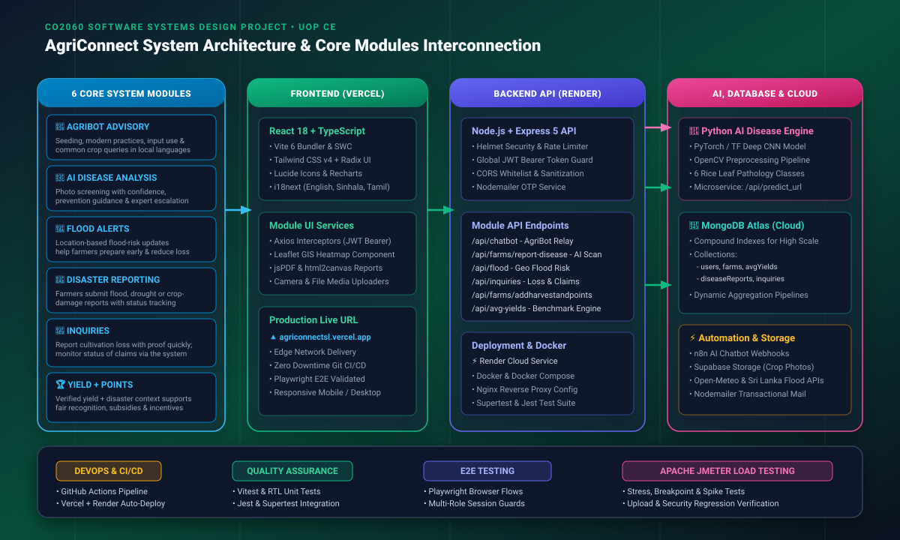
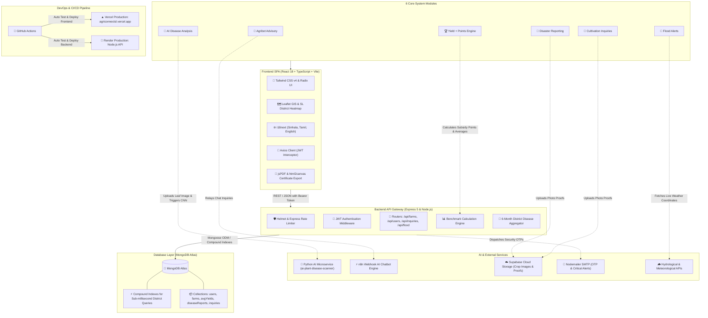

<div align="center">

# 🌱 AgriConnect
### Crop Yield Optimization & Intelligent Plant Disease Analysis System

**CO2060 Software Systems Design Project**  
**Department of Computer Engineering | Faculty of Engineering | University of Peradeniya (UOP)**

<br/>

[](https://agriconnectsl.vercel.app/)
[](https://react.dev/)
[](https://www.typescriptlang.org/)
[](https://vitejs.dev/)
[](https://tailwindcss.com/)
[](https://nodejs.org/)
[](https://expressjs.com/)
[](https://www.mongodb.com/)
[](https://python.org/)
[](https://github.com/features/actions)

<br/>

<a href="https://agriconnectsl.vercel.app/" target="_blank">
  
</a>

<br/><br/>

👉 **Live Web Application:** [https://agriconnectsl.vercel.app/](https://agriconnectsl.vercel.app/)

<br/>

[🌟 Overview](#-project-overview) •
[🧩 Core Modules](#-core-system-modules) •
[🏛️ Architecture & Tech Flow](#%EF%B8%8F-system-architecture--how-technologies-connect) •
[🛠️ Tech Stack](#%EF%B8%8F-technologies-used) •
[🚀 Installation](#-installation--quickstart) •
[🧪 Testing & QA](#-testing--quality-assurance) •
[👥 Contributors](#-team-mythix--contributors) •
[🔗 Links](#-project-links)

</div>

---

## 🌾 Project Overview

**AgriConnect** is an enterprise-grade digital agriculture platform engineered for the **CO2060 Software Systems Design Project** at the **Department of Computer Engineering, University of Peradeniya**.

In Sri Lanka, the paddy and rice sector faces severe structural bottlenecks:
- **Market Asymmetry & "Rice Mafia":** Monopolistic large millers create artificial scarcity and suppress farmgate purchasing prices, leaving farmers vulnerable.
- **Delayed Disease Intervention:** Slow manual identification of fungal and bacterial infections causes catastrophic yield destruction across major agricultural districts.
- **Unstructured Disaster Relief:** Lack of verifiable, empirical harvest and disaster records prevents transparent government subsidy and relief distribution.

**AgriConnect directly solves these issues by unifying AI diagnostics, smart disaster reporting, and an objective yield-to-point incentive structure on the web:**
🌐 **Explore Live:** [https://agriconnectsl.vercel.app/](https://agriconnectsl.vercel.app/)

---

## 🧩 Core System Modules

The platform is designed around **six integrated modules** that streamline communication, safety, productivity, and fair incentives for Sri Lankan farming communities:

<div align="center">
<table width="100%" border="0" style="border-collapse: separate; border-spacing: 12px;">
  <tr>
    <td width="50%" style="background: #f8fafc; border: 1.5px solid #cbd5e1; border-radius: 12px; padding: 18px; vertical-align: top;">
      <div style="display: flex; justify-content: space-between; align-items: center; margin-bottom: 8px;">
        <strong style="color: #065f46; font-size: 15px;">🤖 AGRIBOT ADVISORY</strong>
        <span style="font-size: 20px;">🌾</span>
      </div>
      <p style="color: #334155; font-size: 13px; line-height: 1.5; margin: 0;">
        Seeding, modern practices, input use and common crop questions in local language.
      </p>
      <hr style="border: none; border-top: 1px dashed #cbd5e1; margin: 10px 0;" />
      <small style="color: #64748b;">
        <strong>Tech Realization:</strong> Automated <code>n8n</code> workflow integration, multilingual Sinhala/Tamil/English translation via <code>i18next</code>, real-time AI query handling via <code>/api/chatbot</code>.
      </small>
    </td>
    <td width="50%" style="background: #f8fafc; border: 1.5px solid #cbd5e1; border-radius: 12px; padding: 18px; vertical-align: top;">
      <div style="display: flex; justify-content: space-between; align-items: center; margin-bottom: 8px;">
        <strong style="color: #065f46; font-size: 15px;">🔬 AI DISEASE ANALYSIS</strong>
        <span style="font-size: 20px;">🌾</span>
      </div>
      <p style="color: #334155; font-size: 13px; line-height: 1.5; margin: 0;">
        Photo screening with confidence, prevention guidance and expert escalation.
      </p>
      <hr style="border: none; border-top: 1px dashed #cbd5e1; margin: 10px 0;" />
      <small style="color: #64748b;">
        <strong>Tech Realization:</strong> Deep Learning CNN microservice (PyTorch/OpenCV) hosted at <code>ai-plant-disease-scanner.onrender.com</code>, identifying 6 pathologies with dynamic confidence scoring and agronomic treatments.
      </small>
    </td>
  </tr>
  <tr>
    <td width="50%" style="background: #f8fafc; border: 1.5px solid #cbd5e1; border-radius: 12px; padding: 18px; vertical-align: top;">
      <div style="display: flex; justify-content: space-between; align-items: center; margin-bottom: 8px;">
        <strong style="color: #065f46; font-size: 15px;">🌊 FLOOD ALERTS</strong>
        <span style="font-size: 20px;">🌾</span>
      </div>
      <p style="color: #334155; font-size: 13px; line-height: 1.5; margin: 0;">
        Location-based flood-risk updates help farmers prepare early and reduce losses.
      </p>
      <hr style="border: none; border-top: 1px dashed #cbd5e1; margin: 10px 0;" />
      <small style="color: #64748b;">
        <strong>Tech Realization:</strong> Geo-targeted environmental risk ingestion via <code>/api/flood</code>, spatial coordinate evaluation, early precipitation monitoring to safeguard standing crops.
      </small>
    </td>
    <td width="50%" style="background: #f8fafc; border: 1.5px solid #cbd5e1; border-radius: 12px; padding: 18px; vertical-align: top;">
      <div style="display: flex; justify-content: space-between; align-items: center; margin-bottom: 8px;">
        <strong style="color: #065f46; font-size: 15px;">🚨 DISASTER REPORTING</strong>
        <span style="font-size: 20px;">🌾</span>
      </div>
      <p style="color: #334155; font-size: 13px; line-height: 1.5; margin: 0;">
        Farmers submit flood, drought or crop-damage reports with status tracking.
      </p>
      <hr style="border: none; border-top: 1px dashed #cbd5e1; margin: 10px 0;" />
      <small style="color: #64748b;">
        <strong>Tech Realization:</strong> Geotagged damage submission portal with photo evidence upload via <code>Supabase Storage</code>, real-time lifecycle tracking, and agricultural officer verification boards.
      </small>
    </td>
  </tr>
  <tr>
    <td width="50%" style="background: #f8fafc; border: 1.5px solid #cbd5e1; border-radius: 12px; padding: 18px; vertical-align: top;">
      <div style="display: flex; justify-content: space-between; align-items: center; margin-bottom: 8px;">
        <strong style="color: #065f46; font-size: 15px;">📩 INQUIRIES</strong>
        <span style="font-size: 20px;">🌾</span>
      </div>
      <p style="color: #334155; font-size: 13px; line-height: 1.5; margin: 0;">
        Farmers can report any cultivation loss with proves efficiently and quickly. They can monitor the status of their inquiries via the system.
      </p>
      <hr style="border: none; border-top: 1px dashed #cbd5e1; margin: 10px 0;" />
      <small style="color: #64748b;">
        <strong>Tech Realization:</strong> Dedicated backend inquiry pipeline (<code>/api/inquiries</code>), proof attachment handling, status progression (Pending ➔ In Review ➔ Resolved), and officer messaging.
      </small>
    </td>
    <td width="50%" style="background: #f8fafc; border: 1.5px solid #cbd5e1; border-radius: 12px; padding: 18px; vertical-align: top;">
      <div style="display: flex; justify-content: space-between; align-items: center; margin-bottom: 8px;">
        <strong style="color: #065f46; font-size: 15px;">🏆 YIELD + POINTS</strong>
        <span style="font-size: 20px;">🌾</span>
      </div>
      <p style="color: #334155; font-size: 13px; line-height: 1.5; margin: 0;">
        Verified yield plus disaster context supports fair recognition, subsidies and targeted benefits.
      </p>
      <hr style="border: none; border-top: 1px dashed #cbd5e1; margin: 10px 0;" />
      <small style="color: #64748b;">
        <strong>Tech Realization:</strong> Automated benchmark evaluation against district/island averages (<code>/api/avg-yields</code>), formulaic point crediting, verifiable PDF certification via <code>jsPDF</code>.
      </small>
    </td>
  </tr>
</table>
</div>

---

## 🏛️ System Architecture & How Technologies Connect

The diagram below illustrates how every user touchpoint, module interface, REST API gateway, AI classification engine, and cloud component interoperate:

<div align="center">
  
</div>

<br/>

### 🔄 End-to-End Technology Interconnection (Mermaid)



### 🔗 Technical Connectivity Highlights:
1. **Client & Multi-Language UI:**
   - Deployed at **[agriconnectsl.vercel.app](https://agriconnectsl.vercel.app/)**, users interact with localized screens in English, Sinhala, or Tamil.
2. **Secure Communication Pipeline:**
   - Centralized Axios interceptors (`services/api.ts`) automatically inject `Authorization: Bearer <token>` into outgoing requests.
3. **AI Disease Analysis Connectivity:**
   - When a farmer uploads an affected leaf image, it is stored in **Supabase Storage** and dispatched via POST to the **Python Deep Learning microservice** (`ai-plant-disease-scanner.onrender.com/api/predict_url`).
   - The model evaluates 6 classes (*Bacterial Leaf Blight, Brown Spot, Leaf Blast, Leaf Scald, Narrow Brown Spot, Healthy Leaf*) and returns class confidence distributions.
4. **Disease Heatmap Aggregation:**
   - Backend groups disease incidents across all 25 districts over the past 6 months, feeding the **Leaflet GIS** map with live outbreak density colors.
5. **Yield-to-Point Incentive Math:**
   - Harvest inputs are compared against regional rolling averages (`/api/avg-yields`), immediately computing earned points for transparent subsidy redemption.

---

## 🛠️ Technologies Used

### 🎨 Frontend Layer
| Technology | Badge | Purpose |
| :--- | :--- | :--- |
| **React 18** |  | Dynamic SPA component architecture |
| **TypeScript 5** |  | Strict type safety, clean interfaces, and error prevention |
| **Vite 6** |  | Ultra-fast SWC bundling and developer HMR |
| **Tailwind CSS v4** |  | Utility-first modern responsive UI design |
| **Radix UI** |  | Accessible, unstyled UI primitives |
| **Leaflet GIS** |  | Interactive 25-district disease heatmap visualization |
| **i18next** |  | Tri-lingual localization (English, Sinhala, Tamil) |
| **Recharts** |  | Visual harvest performance charts & officer analytics |
| **jsPDF & html2canvas** |  | Client-side verifiable harvest & subsidy PDF creation |

### ⚙️ Backend & API Gateway
| Technology | Badge | Purpose |
| :--- | :--- | :--- |
| **Node.js 20** |  | Asynchronous event-driven server runtime |
| **Express.js 5** |  | RESTful API routing, controllers, and middleware |
| **Mongoose ODM** |  | Schema modeling, compound indexing, and validation |
| **JWT & bcrypt** |  | Stateless authentication and salted password hashing |
| **Helmet & Rate Limit**|  | HTTP security headers and DDoS rate limiting |
| **Nodemailer** |  | Automated email verification and OTP dispatch |

### 🤖 AI, Automation & Cloud
| Technology | Badge | Purpose |
| :--- | :--- | :--- |
| **Python Computer Vision** |  | Deep Learning / OpenCV rice disease classification engine |
| **n8n Automation** |  | Webhook-driven conversational AgriBot advisory |
| **MongoDB Atlas** |  | High-availability cloud NoSQL database |
| **Supabase Storage** |  | Cloud object bucket storage for crop images and proofs |

### 🚀 DevOps, Deployment & QA
| Technology | Badge | Purpose |
| :--- | :--- | :--- |
| **Vercel** |  | Production deployment for frontend: `agriconnectsl.vercel.app` |
| **Render** |  | Production deployment for Node.js REST API service |
| **GitHub Actions** |  | Full-stack CI/CD automated test and deployment pipeline |
| **Docker & Compose** |  | Multi-container local and production orchestration |
| **Vitest & RTL** |  | Unit and component testing suite |
| **Jest & Supertest**|  | Backend endpoint integration and security tests |
| **Playwright** |  | Cross-browser End-to-End user flow test automation |
| **Apache JMeter** |  | Stress, breakpoint, spike, and load testing suite |

---

## 📸 System Demonstration

<div align="center">
  <table width="100%">
    <tr>
      <td width="50%" align="center">
        <a href="https://agriconnectsl.vercel.app/" target="_blank">
          
        </a>
        <br/>
        <em>Fig 1: AgriConnect Agricultural Overview & Analytics</em>
      </td>
      <td width="50%" align="center">
        <a href="https://agriconnectsl.vercel.app/" target="_blank">
          
        </a>
        <br/>
        <em>Fig 2: 25 Districts Plant Disease Heatmap</em>
      </td>
    </tr>
  </table>
</div>

---

## 🚀 Installation & Quickstart

### Prerequisites
- [Node.js](https://nodejs.org/) (v18.x or v20.x recommended)
- [npm](https://www.npmjs.com/) (v9.x or later)
- [MongoDB](https://www.mongodb.com/) (Local instance or MongoDB Atlas URI)
- [Docker](https://www.docker.com/) *(Optional, for containerized run)*

### 1. Clone the Repository
```bash
git clone https://github.com/cepdnaclk/e22-co2060-Crop-Yield-Optimization-and-Intelligent-Plant-Disease-Analysis.git
cd e22-co2060-Crop-Yield-Optimization-and-Intelligent-Plant-Disease-Analysis
```

### 2. Configure Backend Environment
Create `code/backend/.env`:
```env
PORT=5000
MONGO_URI=mongodb+srv://<username>:<password>@cluster0.mongodb.net/cropYieldDB?retryWrites=true&w=majority
JWT_SECRET=your_super_secret_jwt_key
FRONTEND_URL=http://localhost:3000
EMAIL_USER=your_email@gmail.com
EMAIL_PASS=your_email_app_password
CHATBOT_WEBHOOK_URL=https://n8n-opvk.onrender.com/webhook/d3d42ea4-6323-495c-b7c7-09075db3cdca/chat
```

### 3. Configure Frontend Environment
Create `code/frontend/.env`:
```env
VITE_API_URL=http://localhost:5000
VITE_SUPABASE_URL=https://your-project.supabase.co
VITE_SUPABASE_ANON_KEY=your_supabase_anon_key
```

### 4. Run Locally

#### Option A: Running with npm
```bash
# Terminal 1: Backend Service
cd code/backend
npm install
npm start

# Terminal 2: Frontend Service
cd code/frontend
npm install
npm run dev
```
- Frontend: **http://localhost:3000** (or `http://localhost:5173`)
- Backend API: **http://localhost:5000**
- Online Deployed Platform: **[https://agriconnectsl.vercel.app/](https://agriconnectsl.vercel.app/)**

#### Option B: Running with Docker Compose
```bash
cd code
docker-compose up --build
```

---

## 🧪 Testing & Quality Assurance

AgriConnect includes a comprehensive testing suite across all tiers:

### 1. Frontend Unit & Integration Tests (Vitest)
```bash
cd code/frontend
npm run test
```

### 2. Backend API & Security Tests (Jest & Supertest)
```bash
cd code/backend
npm test
```

### 3. End-to-End User Flow Tests (Playwright)
```bash
cd code/frontend
npm run test:e2e
```

### 4. Load & Performance Testing (Apache JMeter)
Automated test scripts located in `JMeter Tests/`:
- `Test 1.1` - Concurrency Stress Testing
- `Test 2.1` - System Breakpoint Determination
- `Test 3.0` - High-Traffic Spike Testing
- `Test 4.0` - Multipart Leaf Image Upload Stress Test
- `Test 5.0` - Yield & Points Incentive Engine Calculation Under Load
- `Test 6.0` - Security & Authentication Regression Testing

---

## 👥 Team Mythix & Contributors

This project was developed for **CO2060 Software Systems Design Project** by undergraduate students of the **Department of Computer Engineering, Faculty of Engineering, University of Peradeniya**:

<div align="center">
<table border="0" style="margin: 0 auto; text-align: center; border-collapse: collapse;">
  <tr>
    <td align="center" width="25%" style="padding: 16px;">
      <a href="https://people.ce.pdn.ac.lk/students/e22/130/" target="_blank">
        
      </a>
      <br/>
      <strong>S. H. S. Hansara</strong>
      <br/>
      <small><strong>E/22/130</strong></small>
      <br/>
      <span style="display:inline-block; margin-top:4px; padding:2px 8px; background:#dcfce7; color:#15803d; border-radius:12px; font-size:11px; font-weight:600;">Product Owner</span>
      <br/>
      <a href="mailto:e22130@eng.pdn.ac.lk">
        
      </a>
    </td>
    <td align="center" width="25%" style="padding: 16px;">
      <a href="https://people.ce.pdn.ac.lk/students/e22/008/" target="_blank">
        
      </a>
      <br/>
      <strong>T. H. Abeywickrama</strong>
      <br/>
      <small><strong>E/22/008</strong></small>
      <br/>
      <span style="display:inline-block; margin-top:4px; padding:2px 8px; background:#e0f2fe; color:#0369a1; border-radius:12px; font-size:11px; font-weight:600;">Team Leader</span>
      <br/>
      <a href="mailto:e22008@eng.pdn.ac.lk">
        
      </a>
    </td>
    <td align="center" width="25%" style="padding: 16px;">
      <a href="https://people.ce.pdn.ac.lk/students/e22/126/" target="_blank">
        
      </a>
      <br/>
      <strong>H. P. J. Gunawardhana</strong>
      <br/>
      <small><strong>E/22/126</strong></small>
      <br/>
      <span style="display:inline-block; margin-top:4px; padding:2px 8px; background:#ede9fe; color:#6d28d9; border-radius:12px; font-size:11px; font-weight:600;">Project Collaborator</span>
      <br/>
      <a href="mailto:e22126@eng.pdn.ac.lk">
        
      </a>
    </td>
    <td align="center" width="25%" style="padding: 16px;">
      <a href="https://people.ce.pdn.ac.lk/students/e22/135/" target="_blank">
        
      </a>
      <br/>
      <strong>H. T. D. Hatharasinghe</strong>
      <br/>
      <small><strong>E/22/135</strong></small>
      <br/>
      <span style="display:inline-block; margin-top:4px; padding:2px 8px; background:#fce7f3; color:#be185d; border-radius:12px; font-size:11px; font-weight:600;">Project Collaborator</span>
      <br/>
      <a href="mailto:e22135@eng.pdn.ac.lk">
        
      </a>
    </td>
  </tr>
</table>
</div>

---

## 🏛️ Academic Affiliation & Supervision

- **Course:** CO2060 — Software Systems Design Project
- **Academic Department:** [Department of Computer Engineering](http://www.ce.pdn.ac.lk/)
- **Faculty:** [Faculty of Engineering](https://eng.pdn.ac.lk/)
- **University:** [University of Peradeniya (UOP)](https://www.pdn.ac.lk/)

---

## 🔗 Project Links

- 🌐 **Live Web Application:** [https://agriconnectsl.vercel.app/](https://agriconnectsl.vercel.app/)
- 📖 **Project Web Page:** [cepdnaclk.github.io/e22-co2060-Crop-Yield-Optimization-and-Intelligent-Plant-Disease-Analysis](https://cepdnaclk.github.io/e22-co2060-Crop-Yield-Optimization-and-Intelligent-Plant-Disease-Analysis)
- 🐙 **Source Repository:** [github.com/cepdnaclk/e22-co2060-Crop-Yield-Optimization-and-Intelligent-Plant-Disease-Analysis](https://github.com/cepdnaclk/e22-co2060-Crop-Yield-Optimization-and-Intelligent-Plant-Disease-Analysis)
- 🏛️ **Department of Computer Engineering:** [people.ce.pdn.ac.lk](https://people.ce.pdn.ac.lk/)

---

<div align="center">
  <sub>Developed with pride by Team Mythix for the CO2060 Software Systems Design Project • Department of Computer Engineering, University of Peradeniya</sub>
</div>
